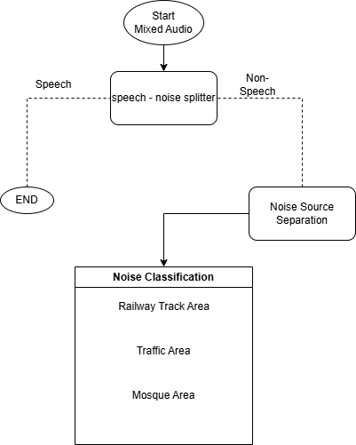

# Use Case : Forensic Background Noise Classification for Enhanced Location Pinpointing

**By:**  
- Kunal Biswas (M24DE2014)  
- Joel Paul (M24DE2012)  

---

## Overview

This project aims to enhance forensic investigations by classifying background noises in audio recordings to assist in precise location identification. By analyzing non-speech elements in audio, the system provides contextual clues that can refine GPS data and improve the accuracy of location pinpointing.

---

## Concept Diagram



---

## Data Preparation

- **UrbanSound8K Dataset:** Utilized 8,732 labeled urban sound clips.
- **Augmentation:** Mixed 2–4 urban sound clips with multi-speaker audio files to simulate real-world environments.
- **Environmental Sounds:** Incorporated additional sounds (e.g., mosque recordings) with speech data.
- **Storage:** Archived and uploaded the augmented datasets to Google Drive for future use.

---

##  Methodology

1. **Audio Conversion:** Transformed input audio to WAV format using FFmpeg.
2. **Voice Activity Detection (VAD):** Employed WebRTC VAD to separate speech and non-speech segments.
3. **Noise Source Separation:** Applied Non-negative Matrix Factorization (NMF) to decompose non-speech audio into distinct background sources.
4. **Feature Extraction:** Extracted features using YAMNet embeddings and computed statistical descriptors (mean, standard deviation, min, max, skewness, kurtosis).
5. **Classification:** Trained machine learning models (SVM, Random Forest, Logistic Regression) to classify background noises.
6. **Location Refinement:** Used classified background noises to enhance GPS-based location data.

---

## Results

| Model                   | Precision | Recall | F1-Score | Accuracy |
|-------------------------|-----------|--------|----------|----------|
| Support Vector Classifier | 0.73      | 0.69   | 0.70     | 0.69     |
| Random Forest Classifier  | 0.79      | 0.76   | 0.76     | 0.76     |
| Logistic Regression       | 0.73      | 0.72   | 0.72     | 0.72     |

The Random Forest Classifier outperformed other models, effectively handling label noise and capturing complex patterns in the data.


---

## Repository Structure

```text
├── main.py                  # Entry-point: process a WAV file and classify noise
├── concept_diagram.png      # Visual diagram of project pipeline
├── requirements.txt         # Python dependencies
├── checkpoints/             # Saved model checkpoints
├── data/                    # Scripts for downloading/synthesizing datasets
├── datasets/                # PyTorch-compatible dataset loaders
├── evaluate/                # Evaluation scripts (not required for end-users)
├── extracted_audio/         # Output folder: segmented non-speech WAVs
├── features/                # Feature extraction scripts (temporal + YAMNet)
├── inference/               # Scripts to load checkpoints and run inference
├── input_audio/             # Input folder for noisy audio samples
├── models/                  # ML and DL model definitions
├── notebooks/               # Colab notebooks for experimentation
├── train/                   # Training scripts for models
└── utils/                   # Utility functions (VAD, conversion, etc.)
```

---

## Getting Started

###  Prerequisites

- Python 3.8+
- Install dependencies:

```bash
pip install -r requirements.txt
```
- Environment setup

Update your runtime environment

base_path(Path to the extracted audio outputs directory) Example - "G:/Forensic_Backround_noise_classification/Speech-vs-Non-Speech-Segmentation/extracted_audio/"
checkpoint_path(Path to the checkpoints directory) Example - "G:/Forensic_Backround_noise_classification/Speech-vs-Non-Speech-Segmentation/checkpoints/"
in_base_path(Path to the input audio directory) Example - "G:/Forensic_Backround_noise_classification/Speech-vs-Non-Speech-Segmentation/input_audio/"
ffmpeg_path(Path to the ffmpeg if you plan to run wav convertion via ffmpeg) Example - "C:/ffmpeg/bin/ffmpeg.exe"

- Run the pipeline
  
```bash
python main.py --input_path input_audio/sample.wav // make sure sample file exists in the runtime environment
or
python main.py
---

## Conclusion

By focusing on non-speech elements in audio recordings, this project demonstrates a novel approach to forensic analysis. The classification of background noises provides additional context that, when combined with GPS data, enhances the accuracy of location identification in forensic investigations.

---

## References

- T. Heittola et al., "Context-dependent sound event detection," IEEE, 2013.
- [Speech Segmentation](https://arxiv.org/abs/2501.03711)
- [Speaker Diarization](https://gist.github.com/EarlJr53/f935eff46d8c8d5a939568a3bed9c655)
- J. Salamon et al., "UrbanSound8K: A Dataset of Urban Sound Recordings," ACM MM, 2014.
- [Librosa: Python Library for Audio and Music Analysis](https://librosa.org/)
- [Streamlit Application on Hugging Face](https://huggingface.co/spaces/Knight-coderr/Forensic-Noise-Classifier)
---

## Contact

For any inquiries or contributions, please contact:

- **Kunal Biswas:** m24de2014@iitj.ac.in
- **Joel Paul:** m24de2012@iitj.ac.in
